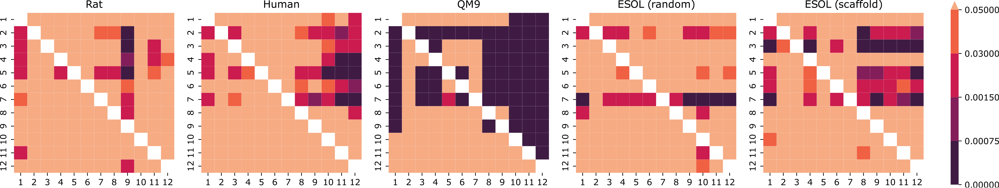

# Comparison of Atom Representations in Graph Neural Networks for Molecular Property Prediction

This repository accompanies article [*Comparison of Atom Representations in Graph Neural Networks for Molecular Property Prediction*](https://arxiv.org/abs/2012.04444) by Agnieszka Pocha, Tomasz Danel, Sabina Podlewska, Jacek Tabor and Łukasz Maziarka.

[:tv: spotlight talk](https://slideslive.com/38942399) for *Machine Learning for Molecules Workshop* at NeurIPS 2020

## Main findings

We compare multiple atom representations for graph neural networks and evaluate them on the prediction of free energy, solubility, and metabolic stability in order to understand the impact of the chosen atom features on the model's performance.

We find that not all atomic features are equally usefull and that removing some of them can improve the performance.



P-values of one-tailed Wilcoxon tests between the best models trained on each representation. The value in i-th row and j-th column corresponds to the alternative hypothesis saying that the median squared error of i-th representation is greater than the median of j-th representation (superior representations have darker columns, and inferior ones have darker rows). The darkest cells are statistically significant with Bonferroni correction.

## How to use this code

### Environment

The list of packages along with versions that we used is as follows:

```
- python=3.7
- cudatoolkit=10.0
- pytorch=1.4.0
- torchvision=0.5.0
- torch-cluster=1.4.5
- torch-geometric=1.4.2
- torch-scatter=2.0.3
- torch-sparse=0.5.1
- torch-spline-conv=1.1.1
- rdkit=2019.09.3
- numpy=1.18.1
- pandas=1.0.1
- scikit-learn=0.22.1
- matplotlib=3.1.3
```

### Run the code

You can run this code with: `python src/main.py configs/models/1-model.cfg configs/data/rat.cfg configs/representations/1-repr.cfg results_dir`, where `configs/models/1-model.cfg` is a configuration file that defines  architecture, `configs/data/rat.cfg` defines which dataset will be used and `configs/representations/1-repr.cfg` defines the representation. The output files will be saved to a subdirectory created in `results_dir`.

To run Wilcoxon tests and generate p-value heatmaps, use this command:

```bash
python wilcoxon.py --model [model name] --source [results directory]
```

## Citation

If you find our results useful, you can cite this work using the following BibTeX entry:

```
@inproceedings{pocha2021comparison,
  title={Comparison of atom representations in graph neural networks for molecular property prediction},
  author={Pocha, Agnieszka and Danel, Tomasz and Podlewska, Sabina and Tabor, Jacek and Maziarka, {\L}ukasz},
  booktitle={2021 International Joint Conference on Neural Networks (IJCNN)},
  pages={1--8},
  year={2021},
  organization={IEEE}
}
```
